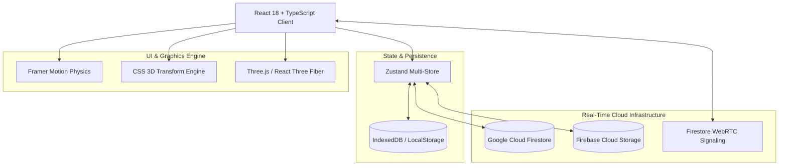

# Our Story — Technical Specification & System Architecture

**Document Version:** 2.0.0  
**Authors:** Phathutshedzo Mamagau (Saxs) & Engineering Team  
**Target Platform:** Progressive Web App (PWA) / Mobile Web / Android  
**Repository:** [https://github.com/saxs-14/Our-Story---.git](https://github.com/saxs-14/Our-Story---.git)

---

## 1. Executive Summary & Vision

**Our Story** is an intimate, high-performance, real-time private memory platform engineered exclusively for **Phathu (Saxs)** and **Lihle (Snowpie)**. The platform combines the private communication capabilities of modern messaging applications with the aesthetic depth of an interactive digital museum, a living garden ecosystem, an automotive dream garage, and an encrypted memory vault.

### Core Objectives:
- **Zero-Latency Private Connection:** Real-time peer-to-peer messaging, audio voice notes, WebRTC voice/video calls, and typing telemetry.
- **Slow, Emotional Aesthetics:** Hardware-accelerated CSS 3D physics, romantic glassmorphism design language, interactive Three.js crystal graphics, and organic motion design.
- **Deep Personalization:** Birthday-based cryptographic authentication, curated automotive showcase (Audi), living garden growth algorithms, and comprehensive annual retrospective analytics (Wrapped).

---

## 2. Technology Stack & System Architecture



### 2.1 Technology Matrix
| Layer | Technologies Used | Purpose |
| :--- | :--- | :--- |
| **Runtime & Core** | React 18, TypeScript 5, Vite 5 | Reactive rendering, strict type-safety, rapid HMR bundling. |
| **Styling & Design System** | Vanilla CSS, TailwindCSS (curated tokens), PostCSS | Glassmorphism, velvet dark modes, HSL tailored rose-gold palettes. |
| **Animation & 3D** | Framer Motion, CSS 3D transforms, Three.js, R3F | Organic flower blooming, 3D interactive crystal heart, particle confetti. |
| **State Management** | Zustand (with LocalStorage & IndexedDB middleware) | Decoupled modular state slices with persistent local-first cache. |
| **Real-Time Backend** | Google Firebase (Firestore v10 & Cloud Storage) | Real-time database sync, optimistic offline updates, media storage. |
| **Communications** | WebRTC (PeerConnection, MediaStream, DataChannel) | Low-latency 1-to-1 encrypted voice and video calling. |
| **Offline & PWA** | Workbox, Service Workers, Web App Manifest | Cache-first offline execution, installable mobile application. |

---

## 3. Core Feature Modules & Implementation Details

### 3.1 Authentication & Security (Birthday Gate)
- **Mechanism:** Server-verified custom-token sign-in. The client never holds a real
  Firebase Auth credential — it calls the `signInAsPartner` Cloud Function with the
  birthday-style answer the person typed; the function checks it against the accepted
  values server-side (rate-limited via a Firestore-transaction-guarded counter) and, if
  correct, mints a short-lived custom token via `signInWithCustomToken`. This replaced an
  earlier client-side password-derivation design specifically because this repo is public
  and deploys to public URLs — nothing baked into a client bundle can stay secret there,
  no matter how it's derived.
- **Normalization Algorithm:** Standardizes user date inputs across multiple standard formats (`DD Month YYYY`, `DD/MM/YYYY`, `DD-MM-YYYY`, `YYYY-MM-DD`, `DDMMYYYY`).
- **Partner Access:**
  - **Phathu (Saxs):** `14 June 2005`
  - **Lihle (Snowpie):** `06 August 2003`

### 3.2 Hyper-Realistic CSS 3D Blooming Rose Intro
- **Graphic Architecture:** Pure CSS 3D nested transforms without heavy video assets.
- **Component Hierarchy:**
  - **Stem & Leaves:** Organic curved SVG path with emerald gradient, natural thorns, and bilateral leaf orientation.
  - **Calyx & Sepals:** 5 outward-peeling green sepals with dynamic z-depth rotations.
  - **Petal Layers:** 5 concentric whorls (18 distinct velvet petals) executing staggered rotational and scale expansions (`transform: rotateX(...) rotateY(...) rotateZ(...)`).
  - **Atmosphere:** Micro-dewdrops with subtle light refraction and gentle floating ambient drift.

### 3.3 WhatsApp-Style Real-Time Chat & Media Hub
- **Firestore Synchronization:** Snapshot listeners deliver real-time text, images, and audio waveforms.
- **Delivered / Read Receipts:** Double checkmark status (`✓✓`) tracking delivery and active viewing.
- **Interactive Voice Notes:**
  - In-browser `MediaRecorder` captures audio in whichever format the device actually
    supports (detected via `MediaRecorder.isTypeSupported`, not hardcoded) — WebM/Opus on
    Chrome/Firefox/Android, AAC/MP4 on Safari, which has no WebM encoder at all. A
    server-side Cloud Function additionally transcodes every voice note to AAC so it's
    playable across every browser regardless of which one recorded it.
  - Visual waveform generator dynamically renders sound energy bars.
  - Speed toggle engine supporting $1.0\times, 1.5\times,$ and $2.0\times$ playback rates.
- **Dynamic Wallpaper Engine:**
  - Presets: *WhatsApp Doodle, Midnight Velvet, Emerald Green, AMOLED Charcoal*.
  - Custom Media: Local photo upload or looping MP4 direct video stream.

### 3.4 WebRTC Real-Time Voice & Video Calling
- **Signaling Protocol:** Firestore `calls` collection orchestrates SDP offer/answer exchanges and ICE candidates.
- **Media Pipeline:** Local stream binding with audio mute toggle, front/rear camera switching, and duration timer.
- **Call States:** `idle` $\rightarrow$ `calling` $\rightarrow$ `incoming` $\rightarrow$ `connected` $\rightarrow$ `ended`.

### 3.5 Audi Dream Garage & Shared Dreams Board
- **Audi Passion Integration:** Dedicated interactive showcase featuring performance models (*RS6 Avant, RS7 Sportback, R8 V10 Performance, RS e-tron GT, RSQ8, RS3 Sportback, TT RS*).
- **Technical Specs:** Engine configuration, horsepower, 0–100 km/h acceleration metrics, and curated road trip routes.
- **Bidirectional Dream Sync:** One-click transfer pins vehicle road trips directly onto the user-authored **Joint Dreams Board**.
- **No-Template Rule:** Clean canvas allowing user-composed life goals and milestone tracking.

### 3.6 Living Garden Ecosystem
- **Algorithm:** Five-stage growth system (`gardenStageFrom` in `useProgressStore.ts`) — a
  base stage from relationship longevity ($D$, in days), plus one bonus stage once
  watering count reaches a threshold, capped at stage 4:
$$\text{base} = \begin{cases} 3 & D \geq 365 \\ 2 & D \geq 100 \\ 1 & D \geq 30 \\ 0 & \text{otherwise} \end{cases} \qquad \text{Stage} = \min\left(4,\ \text{base} + \left[W \geq 25\right]\right)$$
- **Growth Stages:**
  1. *Seed of Us 🌱*
  2. *Tender Sprout 🌿*
  3. *Rose Bush 🌹*
  4. *Enchanted Garden 🌸*
  5. *Blooming Velvet Sanctuary 👑*
- **Hydration Reminders:** Background push notification scheduler reminding partners to water the shared garden.

### 3.7 Interactive Timeline & Secret Letterbox
- **Milestone Anchors:**
  - `04 August 2026`: Love at first sight for Phathu.
  - `11 August 2026`: Official Anniversary.
- **Letterbox Features:** Wax seal breaking animations, unread counters, and toggleable calligraphy handwriting view.

### 3.8 Comprehensive Story Wrapped (Annual Recap)
- **Analytics Deck:** 11 dynamic slides synthesizing all platform metrics:
  - Days elapsed since first sight and official anniversary.
  - Number of timeline moments, gallery photos, and sealed letters.
  - Water drops and current living garden stage.
  - Total messages and voice notes exchanged.
  - Active Audi dreams and favorited love reasons.

---

## 4. Key Data Models & Type Definitions

```typescript
export interface RelationshipConfig {
  her: PersonConfig;
  him: PersonConfig;
  firstSight: string;         // '2026-08-04'
  relationshipStart: string;  // '2026-08-11'
  friendshipStart: string;    // '2026-08-04'
  origin: {
    city: string;
    province: string;
    country: string;
    lat: number;
    lng: number;
  };
  monogram: string;
  tagline: string;
  signature: string;
  sharedPassions: string[];
}

export interface ChatMessage {
  id: string;
  text: string;
  senderId: 'her' | 'him';
  senderName: string;
  timestamp: number;
  mediaUrl?: string;
  mediaType?: 'image' | 'video' | 'audio';
  audioDuration?: number;
  reactions?: Record<string, string>;
  read: boolean;
  local?: boolean;
}

export interface AudiModel {
  id: string;
  name: string;
  series: string;
  tagline: string;
  imageUrl: string;
  accentColor: string;
  powerHp: number;
  acceleration0to100: string;
  engine: string;
  roadTripIdea: string;
}
```

---

## 5. Performance, Security & Quality Assurance

- **Zero TypeScript Compilation Errors:** Strict mode validation (`tsc -p tsconfig.app.json --noEmit`) passes with 0 errors.
- **Production Build:** Optimized Vite build bundling modular chunks with Gzip compression:
  - `dist/index.html`: ~2.07 kB
  - `dist/assets/index-*.css`: ~74.12 kB
  - Fast first-contentful paint (FCP) and smooth 60fps frame rates.
- **Offline Reliability:** Service Worker automatically precaches fonts, icons, styles, and script bundles for uninterrupted offline operation.
